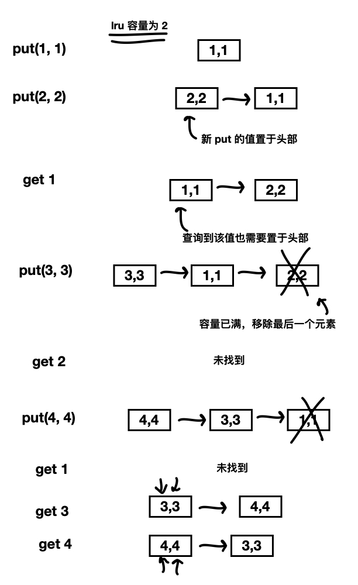
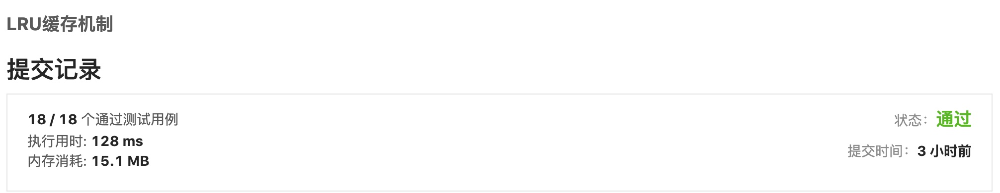

## 题目描述

> 运用你所掌握的数据结构，设计和实现一个  LRU (最近最少使用) 缓存机制。它应该支持以下操作： 获取数据 get 和 写入数据 put 。
>
> 获取数据 get(key) - 如果关键字 (key) 存在于缓存中，则获取关键字的值（总是正数），否则返回 -1。
> 写入数据 put(key, value) - 如果关键字已经存在，则变更其数据值；如果关键字不存在，则插入该组「关键字/值」。当缓存容量达到上限时，它应该在写入新数据之前删除最久未使用的数据值，从而为新的数据值留出空间。
>
> 示例:
>
> LRUCache cache = new LRUCache( 2 /* 缓存容量 */ );
>
> cache.put(1, 1);
> cache.put(2, 2);
> cache.get(1);       // 返回  1
> cache.put(3, 3);    // 该操作会使得关键字 2 作废
> cache.get(2);       // 返回 -1 (未找到)
> cache.put(4, 4);    // 该操作会使得关键字 1 作废
> cache.get(1);       // 返回 -1 (未找到)
> cache.get(3);       // 返回  3
> cache.get(4);       // 返回  4
>
> **进阶:**
>
> 你是否可以在 **O(1)** 时间复杂度内完成这两种操作？


上面的操作如下图所示：




通过上图应该可以大致了解 lru 的工作过程了，要想进一步了解 lru，可以自行网上查阅。


## 算法设计

### 低效率版

如果忽视题目描述中的进阶要求：在 **O(1)** 时间复杂度内完成这两种操作，可以很容易的写出一个 lru 算法，只要通过一个链表，在链表中存储 map 即可实现，

```go
// ⚠️ 低效率，get 和 put 时间复杂度非 O(1)

type LRUCache struct {
	Cap int
	Element *list.List
}

func Constructor(capacity int) LRUCache {
	l := LRUCache{
		Cap:     capacity,
		Element: list.New(),
	}
	return l
}


func (c *LRUCache) Get(key int) int {
	for i := c.Element.Front(); i != nil; i = i.Next() {
		data := i.Value.(map[int]int)
		if val, ok := data[key]; ok {
			// 如果找到，返回的同时将其置于头部
			c.Element.MoveToFront(i)
			return val
		}
	}
	return -1
}

func (c *LRUCache) Put(key int, value int)  {
	e := c.Element

	// 如果 key 已存在，则更新值，同时置于头部
	for i := e.Front(); i != nil; i = i.Next() {
		data := i.Value.(map[int]int)
		if _, ok := data[key]; ok {
			data[key] = value
			// 置于头部
			c.Element.MoveToFront(i)
			return
		}
	}

	// 如果已满，则移除最后一个元素
	if e.Len() == c.Cap {
		e.Remove(e.Back())
	}

	data := make(map[int]int)
	data[key] = value
	e.PushFront(data)
}
```


虽然通过了测试，但是效率非常低下，因为每次 get 和 put 都需要遍历链表，并且判断当前链表存储的 map 的 key，时间复杂度会非常高。


更好的方法：


要让 put 和 get 方法的时间复杂度为 O(1)，我们可以总结出这个数据结构必要的条件：查找快，插入快，删除快，有顺序之分。

因为显然 cache 必须有顺序之分，以区分最近使用的和久未使用的数据；而且我们要在 cache 中查找键是否已存在；如果容量满了要删除最后一个数据；每次访问还要把数据插入到队头。

那么，什么数据结构同时符合上述条件呢？哈希表查找快，但是数据无固定顺序；链表有顺序之分，插入删除快，但是查找慢。所以结合一下，形成一种新的数据结构：哈希链表。

双链表中存储了一对键值对，并且 键 和 哈希表的 键 保持一致，来达到 哈希表映射双链表的目的。

哈希表可以使查询相关操作达到 O(1) 时间复杂度，例如 get 操作，以及 put 中 判断该 key 是否以及存在；通过哈希表可以快速找到对应的链表节点，所以可以保证链表的删除操作也为 O(1) （链表删除虽然只需要改变指针，但是还需要找到该节点）。

具体代码如下：

```go
type LRUCache struct {
	// 最大容量
	cap int
	// map 映射到 双向链表，实现 O(1) 的时间复杂度
	cache map[int]*list.Element
	// 双向链表实现 lru
	list *list.List
}

// 该结构体作为链表的节点值，并且 key 与 cache 的 key 保持同步，
// 以此实现 map 映射到 list
type kv struct {
	key   int
	value int
}

func Constructor(capacity int) LRUCache {
	return LRUCache{
		cap:   capacity,
		cache: make(map[int]*list.Element),
		list:  list.New(),
	}
}

func (c *LRUCache) Get(key int) int {
	// 通过 cache (map 类型) 查询 key，因为 list 节点 value 的 key 与 cache key 相同，
	// 所以可以通过 cache 以 O(1) 查询到对应的 list node
	if v, ok := c.cache[key]; ok {
		// 将查询到的 node 移动到 list 头部
		c.list.MoveToFront(v)
		// cache 的 value 是一个 list node，并且 node value 是 struct kv，
		// 返回 struct kv 的 value
		return v.Value.(*kv).value
	}
	return -1
}

func (c *LRUCache) Put(key int, value int) {
	// 如果该 key 已经存在，则更新 value，并置于 list 头部
	if v, ok := c.cache[key]; ok {
		// 更新位置
		c.list.MoveToFront(v)
		// 更新 value
		v.Value = &kv{
			key:   key,
			value: value,
		}
		// 该 key 不存在
	} else {
		// 如果已经达到最大容量
		if c.list.Len() == c.cap {
			// 删除 cache 中处于末尾的 key
			delete(c.cache, c.list.Back().Value.(*kv).key)
			// 删除 list 中最后一个 node
			c.list.Remove(c.list.Back())
		}
		// 还有剩余容量
		e := &kv{
			key:   key,
			value: value,
		}
		// 置于 list 头部
		c.list.PushFront(e)
		// value 取 list 首元素
		c.cache[key] = c.list.Front()
	}
}
```




可以看到执行耗时缩短了近 7 倍。


注：go 官方有一个分布式 kv缓存库，里面有 lru 的实现方式，地址如下：

https://github.com/golang/groupcache/blob/master/lru/lru.go

<Vssue :title="$title" />