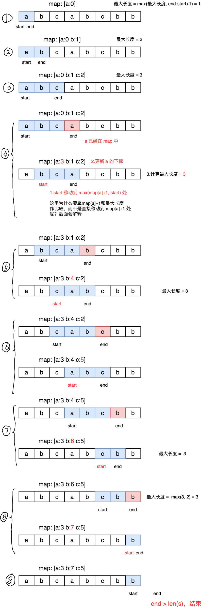
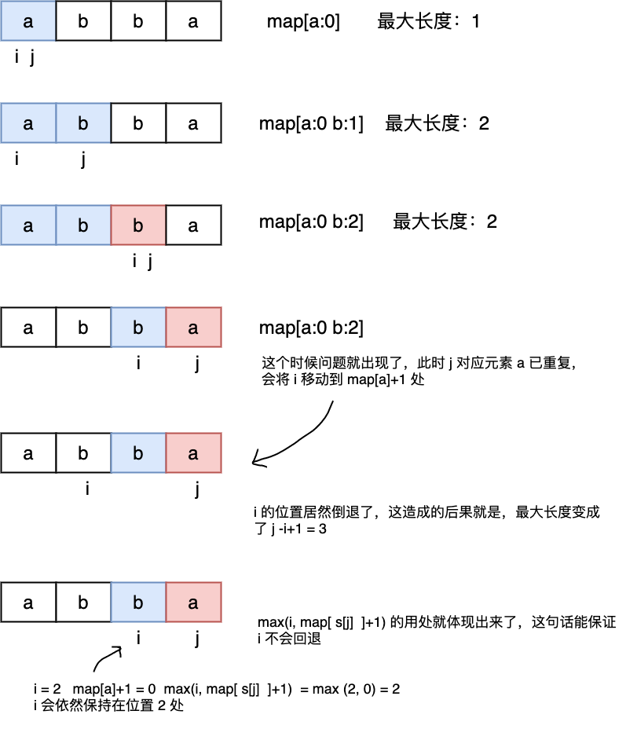

## 题目描述

> 请从字符串中找出一个最长的不包含重复字符的子字符串，计算该最长子字符串的长度。
>
>  
>
> 示例 1:
>
> ```
> 输入: "abcabcbb"
> 输出: 3 
> 解释: 因为无重复字符的最长子串是 "abc"，所以其长度为 3。
> ```
>
> 示例 2:
>
> ```
> 输入: "bbbbb"
> 输出: 1
> 解释: 因为无重复字符的最长子串是 "b"，所以其长度为 1。
> ```
>
> 示例 3:
>
> ```
> 输入: "pwwkew"
> 输出: 3
> 解释: 因为无重复字符的最长子串是 "wke"，所以其长度为 3。
>          请注意，你的答案必须是 子串 的长度，"pwke" 是一个子序列，不是子串
> ```
>
>
> 提示：
>
> s.length <= 40000
>
> 


####  方法1：滑动窗口

通过双指针 + 哈希表实现，算法思路如下：

1. 初始化两个指针 i 和 j，同时指向第一个字符
2. i 指针不动，j 指针不断前进，每次前进都更新其在 map 中的值（值是下标），同时计算最大窗口值
3. 如果 j 在移动过程中遇到重复元素（在 map 中已存在），则将 i 移动到 max(i, map[重复元素]+1) 处，这里为什么要比较大小，后面会解释
4. 当 j 大于字符串长度时，结束循环，返回最大窗口值





对应代码如下：

```go
func lengthOfLongestSubstring(s string) int {
	i, j, maxl := 0, 0, 0
	m := make(map[byte]int)

	for j < len(s) {
		cur := s[j]
		// 当前字符重复
		if _, ok := m[cur]; ok {
			// 移动 i 到重复元素下标+1 处，如果当前位置下标大于 m[cur]+1，则不移动
			i = max(i, m[cur]+1)
		}
		// 如果当前长度更大，则更新最大长度
		maxl = max(maxl, j-i+1)
		m[cur] = j
		j++
	}
	return maxl
}

func max(a, b int) int {
	if a > b {
		return a
	} else {
		return b
	}
}

// 执行用时: 8 ms
// 内存消耗: 3.1 MB

```


#### 疑问

当元素重复时，为什么 i 要移动到 max(i, m[cur]+1) 处，而不是直接移动到 m[cur]+1 处？

刚开始写的时候，我就犯了这个错误，写下了如下代码：

```go
func lengthOfLongestSubstring(s string) int {
    i, j := 0, 0
    m := make(map[byte]int)
    maxl := 0

    for j < len(s) {
        char := s[j]
        if _, ok := m[char]; ok {
            i = m[char] + 1
        } 
      	maxl = max(maxl, j-i)
        m[char] = j
        j++
        
    }
    return maxl
}

func max(a, b int) int {
    if a > b {
        return a
    } else {
        return b
    }
}
```


测试用例：abba，正确结果应该是 2 ，但是上面代码执行却诡异的返回了 3，通过画图分析后才知道了原因所在：





#### 错误记录

```go

func lengthOfLongestSubstring(s string) int {
    i, j := 0, 0
    m := make(map[byte]int)
    maxl := 0

    for j < len(s) {
        char := s[j]
        if _, ok := m[char]; ok {
            maxl = max(maxl, j-i)
            i = m[char] + 1
        } 
        m[char] = j
        j++
        
    }
    return maxl
}

func max(a, b int) int {
    if a > b {
        return a
    } else {
        return b
    }
}
```


测试用例：

au		预期：2		输出：0		

原因：更新最大长度语句写在了 if 内，只有字符重复时才会执行，对于 au 这个没有重复字符的 string，该语言始终不会执行，所以最后会返回 0


" "		预期：1		输出：0

原因：还是和上面一样的情况。


#### 总结

第一次做这道题的时候是毫无头绪的，因为当时并不知道滑动窗口是什么东西，在看了题解后，照猫画虎，大致摸清了算法思路，但对于一些特殊语句，比如 if 中的 max(i, m[s[j]]+1)，却没有很好的理解，只是知道这句话不这样写，答案就不会正确。

这次二刷，则是先大致回想一下之前记忆里的思路，并尝试在不看原来正确代码的情况下，先自己写写，结果就发现了很多问题，一些测试用例无法通过，这时再结合之前的正确代码，比较自己写的代码的缺陷并改正，对于特殊语句也理解清楚了。

所以这道题给我的感悟就是，做题还是得自己动手实践才能真正理解，只是看别人的代码，很有可能会处于半知半解状态。算法题就是这样，往往你以为自己做对了，实际并没有，就是有几个刁钻的测试用例过不去，只要有 1 个测试过不去，就说明这个代码写的是有问题的，这个时候再结合错误仔细分析，查找发现有问题的地方，就能更好的理解代码。如果只是看别人的，少了发现并改正错误的过程，对代码的理解也会不够透彻，。

总的来说，在不会做的情况下可以看别人的题解，学习方法和思路，但不能只看不写，要试着将别人的思路转换成自己的。


<Vssue :title="$title" />