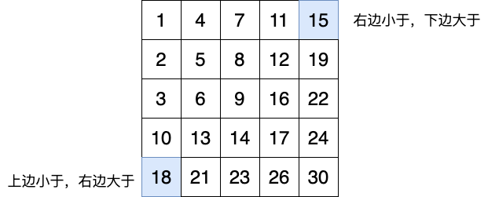
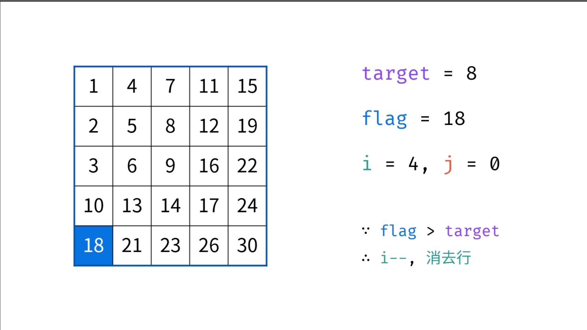
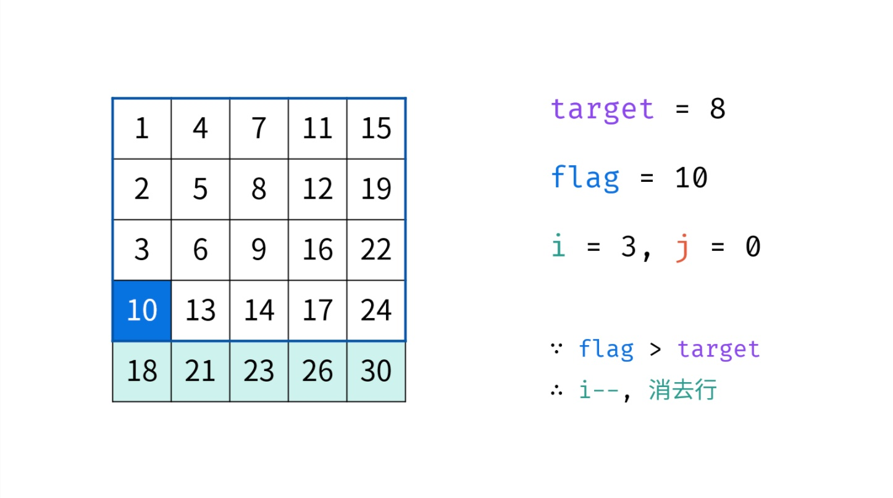
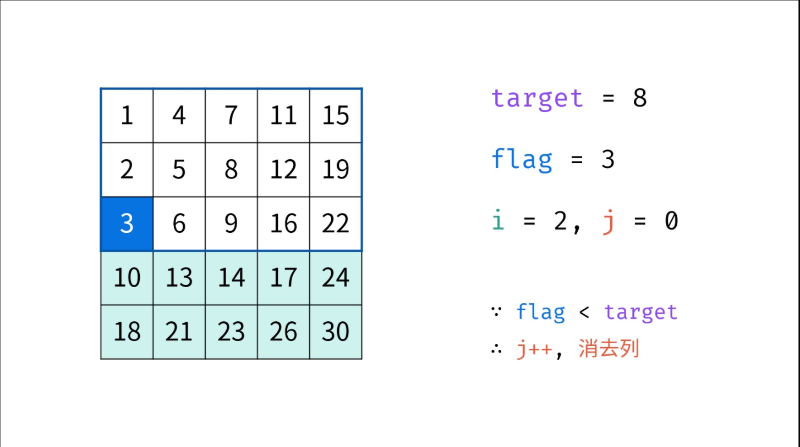
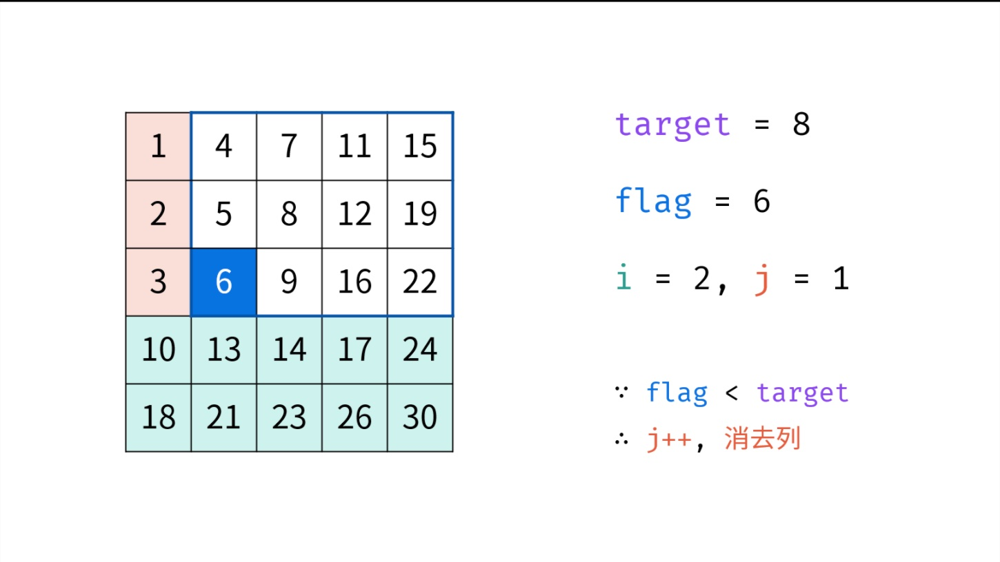
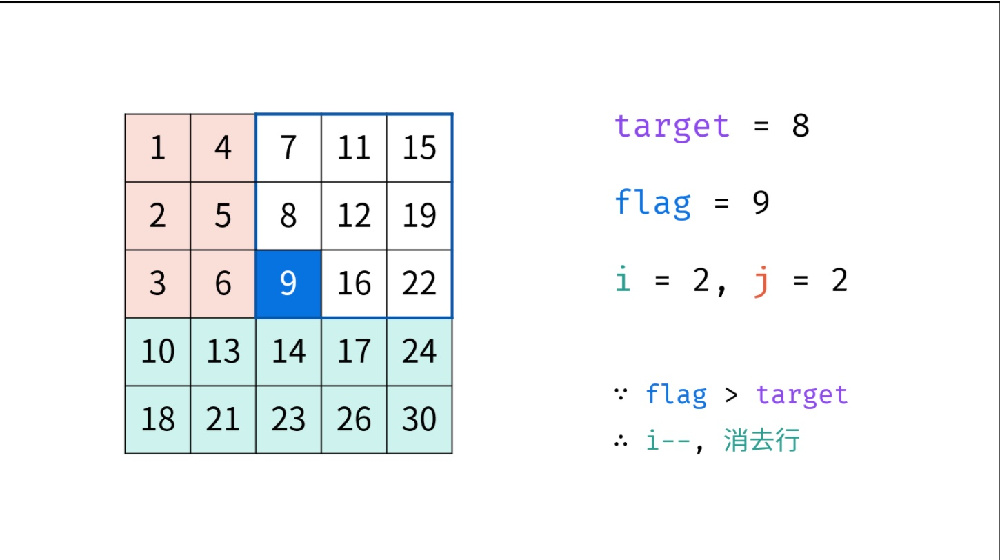
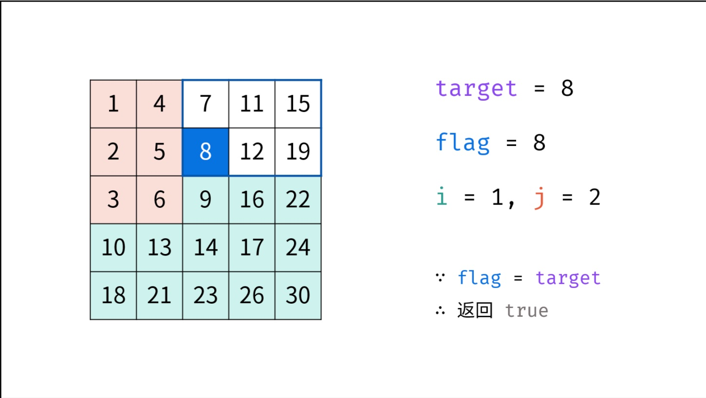
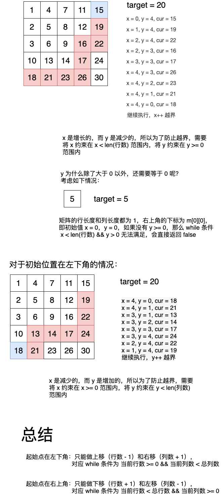

## 题目描述

> 在一个 n * m 的二维数组中，每一行都按照从左到右递增的顺序排序，每一列都按照从上到下递增的顺序排序。请完成一个高效的函数，输入这样的一个二维数组和一个整数，判断数组中是否含有该整数。
>
> 
>
> **示例：**
>
> 现有矩阵 matrix 如下：
>
> ```
> [
>   [1,   4,  7, 11, 15],
>   [2,   5,  8, 12, 19],
>   [3,   6,  9, 16, 22],
>   [10, 13, 14, 17, 24],
>   [18, 21, 23, 26, 30]
> ]
> ```
>
> 
>
> 给定 target = 5，返回 true。
>
> 给定 target = 20，返回 false。
>
> 
>
> **限制：**
>
> ```
> 0 <= n <= 1000
> 0 <= m <= 1000
> ```


## 分析

因为矩阵是从上往下、从左往右递增的，所以可以选择左下角或者右上角为起始点：





算法流程：

从起始点 m[a] [b]  开始判断，如果是 **右上角**，若当前值 **大于** target，则可以 b-- 去掉 **当前列** ，若当前值 **小于**  target，可以 a++ 去掉 **当前行** ，左下角也类似


图解，这里借用一下别人的：

作者：jyd
链接：https://leetcode-cn.com/problems/er-wei-shu-zu-zhong-de-cha-zhao-lcof/solution/mian-shi-ti-04-er-wei-shu-zu-zhong-de-cha-zhao-zuo/














结合上面的图示，这道题的思路还是比较好理解的，但是代码并不好写，主要是 while 条件比较难把握，很容易出错，比如对于以下测试用例： 

```
// 越界
[[1,4,7,11,15],[2,5,8,12,19],[3,6,9,16,22],[10,13,14,17,24],[18,21,23,26,30]]
20

// 不执行 while，直接返回 false
[[-5]]
-5
```


具体分析如下：




## 代码

起始点在左下角：

```go
func findNumberIn2DArray(matrix [][]int, target int) bool {
    if len(matrix) == 0 || len(matrix[0]) == 0 {
        return false
    }
    
    i, j := len(matrix)-1, 0
    var flag int

    
    for i >= 0 && j < len(matrix[0]) {
        flag = matrix[i][j]
        if flag > target {
            i--
        } else if flag < target {
            j++
        } else {
            return true
        }
    }
    return false
}
```


起始点在右上角：

```go
func findNumberIn2DArray(matrix [][]int, target int) bool {
    if len(matrix) == 0 {
        return false
    }
    if len(matrix[0]) == 0 {
        return false
    }
    i, j := 0, len(matrix[0])-1
    var flag int

    for i < len(matrix) && j >= 0 {
        flag = matrix[i][j]
        if flag > target {
            j--
        } else if flag < target {
            i++
        } else {
            return true
        }
        //fmt.Printf("i -> %d  j -> %d\n", i, j)
        //fmt.Println("flag: ", flag)
        //flag = matrix[i][j]
    }
    return false
}
```


<Vssue :title="$title" />