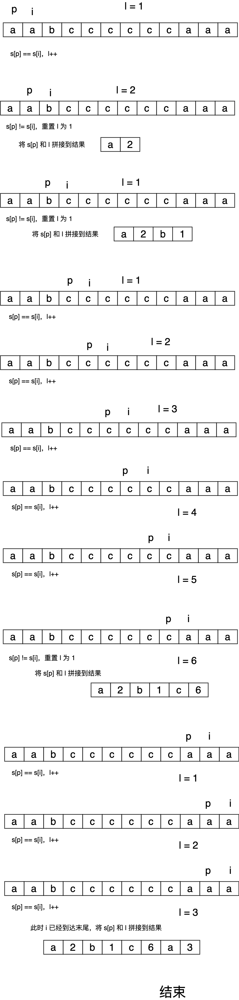

# 面试题 01.06. 字符串压缩


## 题目描述

> 字符串压缩。利用字符重复出现的次数，编写一种方法，实现基本的字符串压缩功能。比如，字符串aabcccccaaa会变为a2b1c5a3。若“压缩”后的字符串没有变短，则返回原先的字符串。你可以假设字符串中只包含大小写英文字母（a至z）。
>
> 示例1:
> 
> 输入："aabcccccaaa"
>  输出："a2b1c5a3"
>示例2:
> 
> 输入："abbccd"
>  输出："abbccd"
>  解释："abbccd"压缩后为"a1b2c2d1"，比原字符串长度更长。
> 提示：
> 
> 字符串长度在[0, 50000]范围内。
> 


## 双指针





代码

```go
func compressString(S string) string {
    var sb strings.Builder
    p, l := 0, 1    // l 记录长度，初始值为 1
    var cur byte

    // 指针 p 从 0 开始，i 从 1 开始
    for i := 1; i < len(S); i++ {
        cur = S[p]
        if S[i] == cur {
            l++
        } else  {
            sb.WriteByte(cur)
            sb.WriteString(strconv.Itoa(l))
            l = 1   // 重置 l
        } 
        if i == len(S) - 1 {    // 到最后一个 char 了
            sb.WriteByte(S[i])  
            sb.WriteString(strconv.Itoa(l))
        }
        p++
    }

    // 压缩后没有变短则返回原先的字符串
    // 长度为 1 的也直接返回
    if sb.Len() >= len(S) || len(S) <= 1 {
        return S
    }
    return sb.String()
}
```


<Vssue :title="$title" />