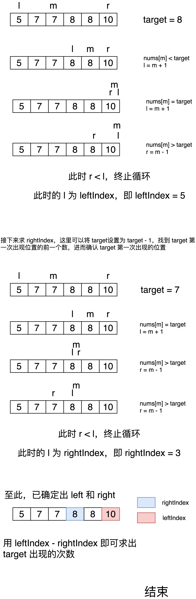

## 题目描述

> 
>统计一个数字在排序数组中出现的次数。
>
>
>示例 1:
>
>输入: nums = [5,7,7,8,8,10], target = 8
>输出: 2
>示例 2:
>
>输入: nums = [5,7,7,8,8,10], target = 6
>输出: 0
>
>
>限制：
>
>0 <= 数组长度 <= 50000


####  方法1：二分查找

这道题最简单粗暴的方法就是从头遍历，当获取到值等于 target 的元素时开始累加次数，直到当前值不等于 target，但是这样做的话时间复杂度为 O(n)，此外像这种暴力法也显然不是一个合格的解决方案。

解决这道题的另一种方式是 `二分查找`，这道题属于二分查找的一个变种，常规的二分查找，在 nums[mid] == target 时返回，但是这道题要求的是寻找出 target 出现的次数，所以区别就在于 nums[mid] == target 时的处理。

整道题的思路可以是这样：先查找出 target 最后出现的位置，记为 leftIndex，再查找出 target 第一次出现的位置，记为 rightIndex，然后用 leftIndex - rightIndex + 1 即可求出出现的次数。

至于二分查找的特殊处理，可以将 [mid] == target 时处理为 left = mid + 1。

具体的流程如下图：




代码如下：
```go
func search(nums []int, target int) int {
    leftIndex := binarySearch(nums, target)
    rightIndex := binarySearch(nums, target-1)

    return leftIndex - rightIndex
}

func binarySearch(nums []int, target int) int {
    l, r := 0, len(nums)-1

    for l <= r {
        m := (l + r) >> 1
        if nums[m] <= target {
            l = m + 1
        } else {
            r = m - 1
        }
    }

    return l
}
```


<Vssue :title="$title" />