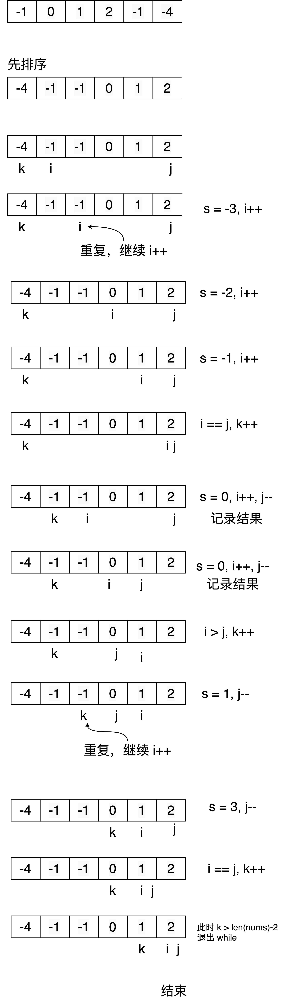

## 题目描述

> 给你一个包含 n 个整数的数组 nums，判断 nums 中是否存在三
> 个元素 a，b，c ，使得 a + b + c = 0 
> 请你找出所有和为 0 且不重复的三元组。
>
> 注意：答案中不可以包含重复的三元组。
>
> 
> 示例 1：
>
> 输入：nums = [-1,0,1,2,-1,-4]
> 输出：[[-1,-1,2],[-1,0,1]]
> 示例 2：
>
> 输入：nums = []
> 输出：[]
> 示例 3：
>
> 输入：nums = [0]
> 输出：[]
> 
>
> 提示：
>
> 0 <= nums.length <= 3000
> -105 <= nums[i] <= 105
>

## 方法1：排序 + 双指针

### 算法流程

大致流程：

1. 首先将数组按 `升序` 排序
2. 准备三个指针 k、i、j
3. 初始化，将 k 放置在第一个元素，i 放置在 k+1 处，j 放置在最后一个元素处
4. 开始循环，条件为 k < len(nums)-2
5. 如果当前 nums[k] > 0，则 break
6. 如果 nums[k--] 和 nums[k] 相同，则 continue 去重
7. 固定 k ，先移动 i 和 j，当 i == j 时，再移动 k 
8. 在移动 i 和 j 时计算 `nums[k] + nums[j] + nums[i]` 的值，记为 s
	1. 如果 s < 0，将 i++，如果 nums[i++] == nums[i]，则继续 + 1，这样可以保证不取到重复元素
	2. 如果 s > 0，将 j--，如果 nums[j--] == nums[j]，则继续 - 1，原因同上
	3. 如果 s == 0，记录当前的三个数字，之后将 i++，j--，移动同时和上面一样，进行去重处理

分析：

因为数组是排好序的，所以 k 指向的是最小元素，i 指向次小元素，j 指向最大元素（排除一些特殊情况比如 [0, 0, 0, 0]）

这里的 k 起的是固定作用，目的是枚举全部情况，当三个值的和小于 0 时，可以将 i++ 使和增大，同理当和大于 0 时，可以将 j-- 将和减小，当和等于 0 时，说明此时已经搜集到了结果，可以将 k++ 进行下个数的枚举

第 5 步的原因是：因为 nums[j] >= nums[i] >= nums[k] > 0，即 3 个数字都大于 0 ，在此固定指针 k 之后不可能再找到结果了。

第 4 步的条件为 k < len(nums)-2，原因是 i 和 j 都在 k 之后，当 k 在 len(nums)-2-1 处时，j 在最后一个，i 在倒数第二个，k，i，j 刚好对应最后三个数，所以可以作为最后一次判断。这只是一个优化，可以减少 2 次不必要的循环，k < len(nums) 依然是正确的。

流程如下图：



代码如下：

未优化版，是我根据上面思路写的：

```go
func threeSum(nums []int) [][]int {
	res := make([][]int, 0)
	if len(nums) == 0 {
		return res
	}
	sort.Slice(nums, func(i, j int) bool {
		return nums[i] < nums[j]
	})

	k := 0
	i, j := k+1, len(nums)-1
	for k < len(nums)-2 {
		count++
		s := 0
		// [-1, 0, 0]
		if i >= j {
			k++
			continue
		}

		if nums[k] > 0 {
			break
		}
		//fmt.Println(k, i, j)
		s = nums[k] + nums[i] + nums[j]
		if s > 0 {
			for i < j && nums[j] == nums[j-1] {
				j--
			}
			j--
		} else if s < 0 {
			for i < j && nums[i] == nums[i+1] {
				i++
			}
			i++
		} else {
			r := make([]int, 0)
			r = append(r, nums[k], nums[i], nums[j])
			res = append(res, r)
			for i < j && nums[i] == nums[i+1] {
				i++
			}
			for i < j && nums[j] == nums[j-1] {
				j--
			}
			i++
			j--

		}

		if i >= j {
			for k < len(nums)-1 && nums[k] == nums[k+1] {
				k++
			}
			k++
			i, j = k+1, len(nums)-1
		}
	}
	return res
}	
```

优化版，来自题解：

```go
func threeSum1(nums []int) [][]int {
	sort.Slice(nums, func(i, j int) bool {
		return nums[i] < nums[j]
	})
	res := make([][]int, 0)

	for k := 0; k < len(nums)-2; k++ {
		count++
		if nums[k] > 0 {
			break
		}
		if k > 0 && nums[k] == nums[k-1] {
			continue
		}

		i, j := k+1, len(nums)-1

		for i < j {
			count++
			sum := nums[i] + nums[j] + nums[k]
			if sum < 0 {
				for i < j && nums[i] == nums[i+1] {
					i++
				}
				i++
			} else if sum > 0 {
				for i < j && nums[j] == nums[j-1] {
					j--
				}
				j--
			} else {
				r := make([]int, 0)
				r = append(r, nums[k], nums[i], nums[j])
				res = append(res, r)

				for i < j && nums[i] == nums[i+1] {
					i++
				}
				i++
				for i < j && nums[j] == nums[j-1] {
					j--
				}
				j--
			}
		}
	}
	return res
}
```

经过测试，这两个函数的执行时间相差了三十倍！不知道为何性能差距会如此之大，可能是我写的冗余判断条件太多了，暂时也没有去仔细分析的想法，只能说明自己的逻辑能力还是菜的抠脚，还需要多多去练习才行。


<Vssue :title="$title" />