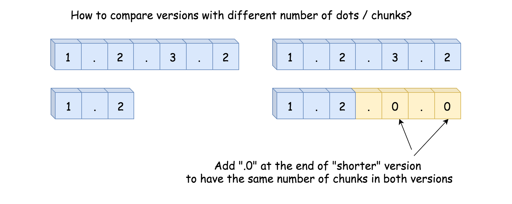
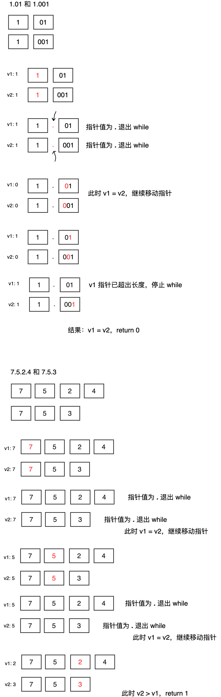

## 题目描述

> 给你两个版本号 version1 和 version2 ，请你比较它们。
>
> 版本号由一个或多个修订号组成，各修订号由一个 '.' 连接。每个修订号由 多位数字 组成，可能包含 前导零 。每个版本号至少包含一个字符。修订号从左到右编号，下标从 0 开始，最左边的修订号下标为 0 ，下一个修订号下标为 1 ，以此类推。例如，2.5.33 和 0.1 都是有效的版本号。
>
> 比较版本号时，请按从左到右的顺序依次比较它们的修订号。比较修订号时，只需比较 忽略任何前导零后的整数值 。也就是说，修订号 1 和修订号 001 相等 。如果版本号没有指定某个下标处的修订号，则该修订号视为 0 。例如，版本 1.0 小于版本 1.1 ，因为它们下标为 0 的修订号相同，而下标为 1 的修订号分别为 0 和 1 ，0 < 1 。
>
> 返回规则如下：
>
> 如果 version1 > version2 返回 1，
> 如果 version1 < version2 返回 -1，
> 除此之外返回 0。
>
>
> 示例 1：
>
> 输入：version1 = "1.01", version2 = "1.001"
> 输出：0
> 解释：忽略前导零，"01" 和 "001" 都表示相同的整数 "1"
> 示例 2：
>
> 输入：version1 = "1.0", version2 = "1.0.0"
> 输出：0
> 解释：version1 没有指定下标为 2 的修订号，即视为 "0"
> 示例 3：
>
> 输入：version1 = "0.1", version2 = "1.1"
> 输出：-1
> 解释：version1 中下标为 0 的修订号是 "0"，version2 中下标为 0 的修订号是 "1" 。0 < 1，所以 version1 < version2
> 示例 4：
>
> 输入：version1 = "1.0.1", version2 = "1"
> 输出：1
> 示例 5：
>
> 输入：version1 = "7.5.2.4", version2 = "7.5.3"
> 输出：-1
>
> 提示：
>
> 1 <= version1.length, version2.length <= 500
> version1 和 version2 仅包含数字和 '.'
> version1 和 version2 都是 有效版本号
> version1 和 version2 的所有修订号都可以存储在 32 位整数 中


## 算法设计

### 1.切割比较

思路：使用 strings.split() 函数，按 `.` 切割，再使用 atoi() 将切割好的字符转换为整形，并一一比较。

上面的问题：如果两个版本号长度不同，例如 1.0 和 1.0.0，切割出的数组分别为 [1, 0] 和 [1, 0, 0]，按下标逐一比较，会有一个出现越界异常

解决方法：对较短的数组进行扩充，使二者长度相同，扩充元素为 0，因为 0 不会对结果产生影响，例如上面的例子，可以将 1 扩充为 [1, 0, 0]，这样就可以安全比较了。




代码如下：

```go
func compareVersion(version1 string, version2 string) int {
    v1arr := strings.Split(version1, ".")
    v2arr := strings.Split(version2, ".")
    
  	// 为较短数组填充 0，使两个数组的长度相同
    if len(v1arr) > len(v2arr) {
        sub := len(v1arr) - len(v2arr)
        for sub > 0 {
            v2arr = append(v2arr, "0")
            sub--
        }
    } else if len(v1arr) < len(v2arr) {
        sub := len(v2arr) - len(v1arr)
        for sub > 0 {
            v1arr = append(v1arr, "0")
            sub--
        }
    }
    
    for i := 0; i < len(v1arr); i++ {
        // 转换为整形比较，无需担心 001 这样的字符串，atoi() 会智能的将其转换为 1
        v1i, _ := strconv.Atoi(v1arr[i])
        v2i, _ := strconv.Atoi(v2arr[i])
        if v1i > v2i {
            return 1
        } else if v1i < v2i {
            return -1
        } else {
            continue
        }
    }
    return 0
}
```


### 2.双指针

第一种方法比较直观易懂，但是需要额外的空间，还需要多次遍历，效率不是很高，而双指针法可以解决上述的问题。

思路：准备两个指针，分别置于两个版本号的开头，之后不断移动两个指针，直到都到达末尾。在移动的过程中，初始化两个变量 v1，v2 用于保存当前小版本号的值，如何获取小版本号的值呢？只需要使用 while 循环不断移动指针，当指针值为 `.` 时停止，每次循环都将 v1 = v1 + 指针值 - '0'，

 


```go
func compareVersion(version1 string, version2 string) int {
    l1, l2 := len(version1), len(version2)
    p1, p2 := 0, 0

  	// 获取最大值 
    var maxFunc = func(x, y int) int {
        if x > y {
            return x
        } else {
            return y
        }
    }

    max := maxFunc(l1, l2)
    for p1 < max || p2 < max {
        var v1, v2 int
      	// 使用 while 来循环读取一个小版本号（例如 1.111 中的 1 和 111 就是小版本号），
 		// 遇到 . 停止，此时 vv1, vv2 的值即是小版本号，vv1 和 vv2 定义在外层 for 内，
        // 每次比较后都会清零
        for p1 < l1 && version1[p1] != '.' {
            v1 = v1*10 + int(version1[p1]) - '0'
            p1++
        }

        for p2 < l2 && version2[p2] != '.' {
            v2 = v2*10 + int(version2[p2]) - '0'
            p2++
        }

        if v1 > v2 {
            return 1
        } else if v1 < v2 {
            return -1
        }
        p1++
        p2++
    }
    return 0
}
```

## 错误记录

### 1. 超出时间限制

```go
    func compareVersion(version1 string, version2 string) int {
    p1, p2 := 0, 0

    for p1 < len(version1) || p2 < len(version2) {
        v1, v2 := 0, 0
        for p1 < len(version1) && version1[p1] != '.' {
            v, _ := strconv.Atoi(string(version1[p1]))
            v1 += v
            p1++
        }
        for p2 < len(version2) && version1[p2] != '.' {
            v, _ := strconv.Atoi(string(version1[p2]))
            v2 += v
            p2++
        }
        
        if v1 > v2 {
            return 1
        } else if v1 < v2 {
            return -1
        }
    }
    return 0
}
```
这里超时的原因是末尾没有 p1++ 和 p2++，当 p1 和 p2 都为 '.' 时，p1 和 p2 将不会有任何改变，这会导致 while 条件一直满足，从而陷入死循环。

所以末尾的 p1++ 和 p2++ 就是用来保证当 p1，p2 都为 '.' 时仍然会移动，防止死循环的发生。

### 2. 解答错误

```go
    func compareVersion(version1 string, version2 string) int {
    p1, p2 := 0, 0

    for p1 < len(version1) || p2 < len(version2) {
        v1, v2 := 0, 0
        for p1 < len(version1) && version1[p1] != '.' {
            v, _ := strconv.Atoi(string(version1[p1]))
            v1 += v
            p1++
        }
        for p2 < len(version2) && version2[p2] != '.' {
            v, _ := strconv.Atoi(string(version2[p2]))
            v2 += v
            p2++
        }
        
        if v1 > v2 {
            return 1
        } else if v1 < v2 {
            return -1
        }
        p1++
        p2++
    }
    return 0
}
```

测试用例：

```
    "1.1"
    "1.10"
```
这里错误的原因是因为对于小版本号只是单纯的相加操作，对于 1.10 的第二个小版本而言，结果为 1 + 0 = 1，从而导致错误结果 1.1 = 1.10，解决方法是将对应小版本号从 string 转为 int，具体方法是 v = v*10 + s[i] - '0'。

<Vssue :title="$title" />