## 题目描述

> 把一个数组最开始的若干个元素搬到数组的末尾，我们称之为数组的旋转。输入一个递增排序的数组的一个旋转，输出旋转数组的最小元素。例如，数组 [3,4,5,1,2] 为 [1,2,3,4,5] 的一个旋转，该数组的最小值为1。  
>
> 示例 1：
> 
>输入：[3,4,5,1,2]
> 输出：1
>示例 2：
> 
>输入：[2,2,2,0,1]
> 输出：0
> 
> 

图片来源：https://leetcode-cn.com/problems/xuan-zhuan-shu-zu-de-zui-xiao-shu-zi-lcof/solution/mian-shi-ti-11-xuan-zhuan-shu-zu-de-zui-xiao-shu-3/

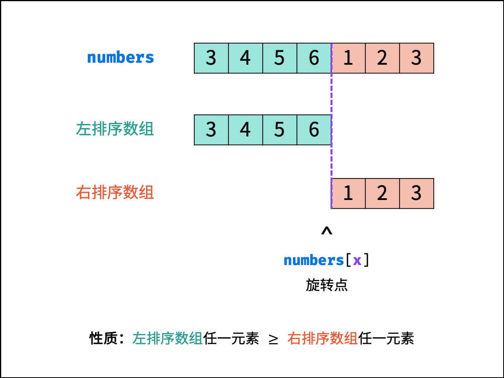

从上图可以看出来，所谓的旋转数组，实质上是变成了两个有序数组，且左边的有序数组要大于右边的有序数组，所以右边的有序数组的第一个值，就是整个数组中的最小值。

二分查找，是通过每次缩短查找区间来减少查找的次数，但前提是数组必须是有序的，而旋转数组恰好破坏了数组的有序性，但这并不代表旋转数组就不能使用二分查找来解决问题了。


## 思路

1. 还是和常规的二分查找一样，先创建两个指针（left 和 right），分别置于数组的第一个数（left）和最后一个数（right），并相加除以二求出中位
2. 接下来判断中位属于哪个有序数组，是左边的还是右边的，具体的判断方法后面会提到
3. 在确定了属于哪个有序数组后，就可以像普通的二分查找一样，去掉一部分的查找区间了，如何去除，后面会提到
4. 不断更新指针，直到两个指针在同一位置 


1.如何判断中位属于左边还是右边？

如果中位值 **大于** right 的值，说明在左边数组
如果中位值 **小于** right 的值，说明在右边数组

例如：
[4, 5, 1, 2, 3]，中位值为 1，小于 right 3，所以在右边数组
[3, 4, 5, 1, 2]，中位值为 5，大于 right 2，所以在左边数组


2.在确定了中位所属数组后，如何缩短查找空间？

因为左数组要大于右数组，所以：

~~如果中位在右数组，那么可以直接去掉左数组，例如 [4, 5, **1**, 2, 3]，左数组 [4, 5] 是要大于右数组 [1, 2, 3] 的，所以可以直接去掉 4, 5 这两个元素，但其本身有可能是最小元素，所以不能去除。~~

如果中位在左数组，那么可以去掉其左边的所有元素以及它自己，因为左数组是要大于右数组的，例如 [3, 4, **5**, 1, 2]，可以直接将 3，4，5全部去掉  

如果中位在右数组，那么可以去掉其右边的所有元素，因为这些元素是一定比它大的，例如 [5, 1, **2**, 3, 4]，中位所处数组为 [1, 2, 3, 4]，它右边的 3 和 4 可以直接去除掉。


一种特殊情况：
[1, 0, **1**, 1, 1]，中位的值和 right 值相等，这时该如何处理呢？参照力扣的题解说法：遇到 `nums[mid] == nums[right]` 的时候，不能草率地下定结论最小数字在哪一边，但是可以确定的是，把 `right` 舍弃掉，并不影响结果。


## 图解

图片来源：https://leetcode-cn.com/problems/xuan-zhuan-shu-zu-de-zui-xiao-shu-zi-lcof/solution/mian-shi-ti-11-xuan-zhuan-shu-zu-de-zui-xiao-shu-3/

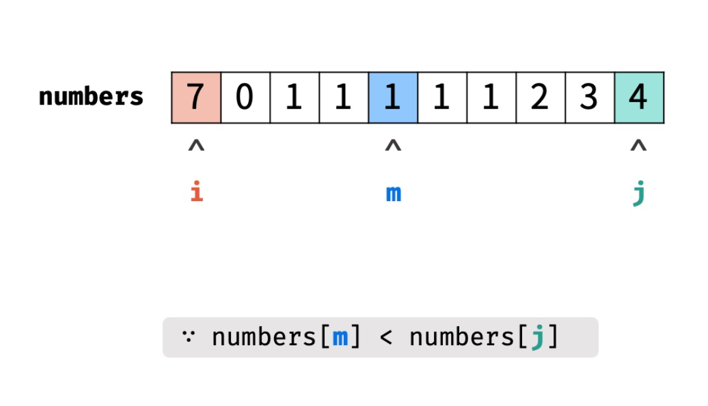

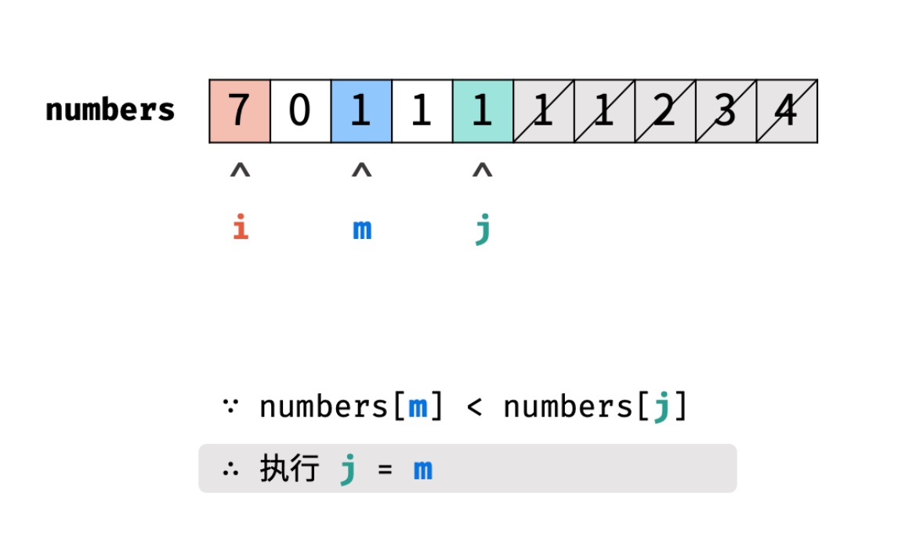

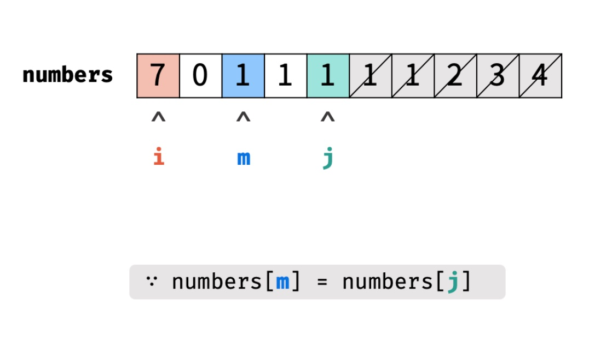

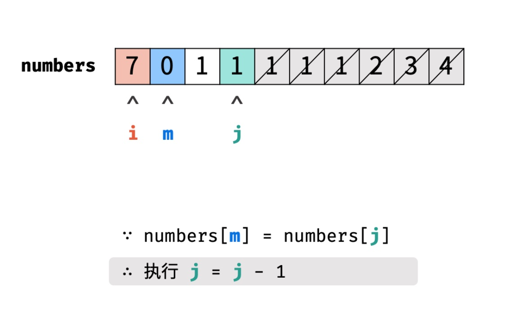

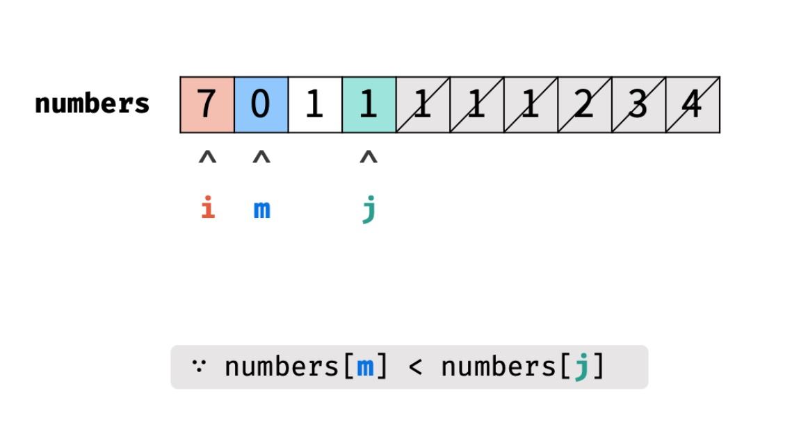

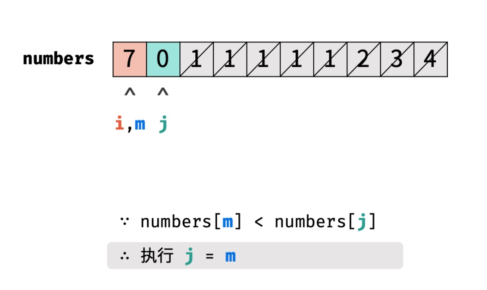

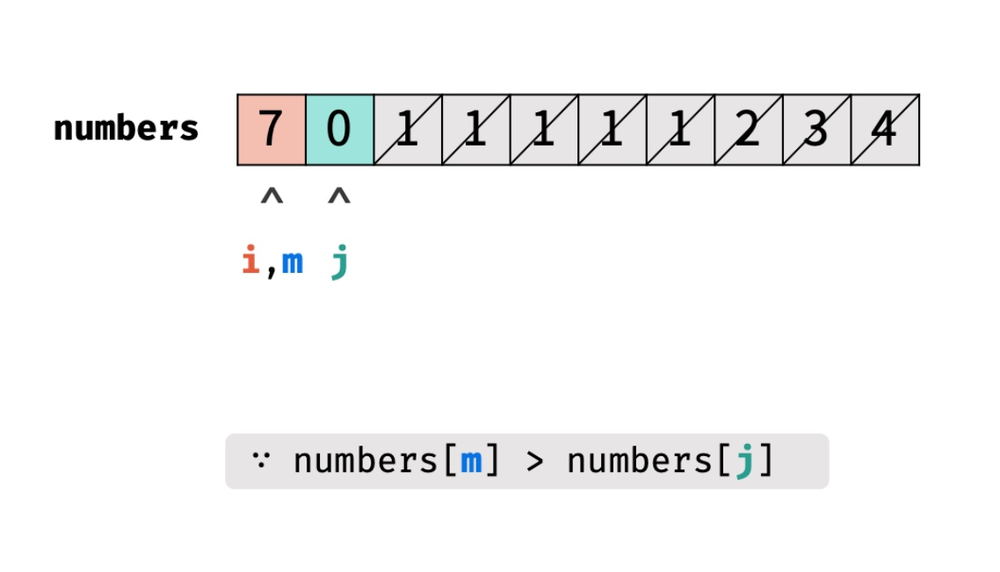

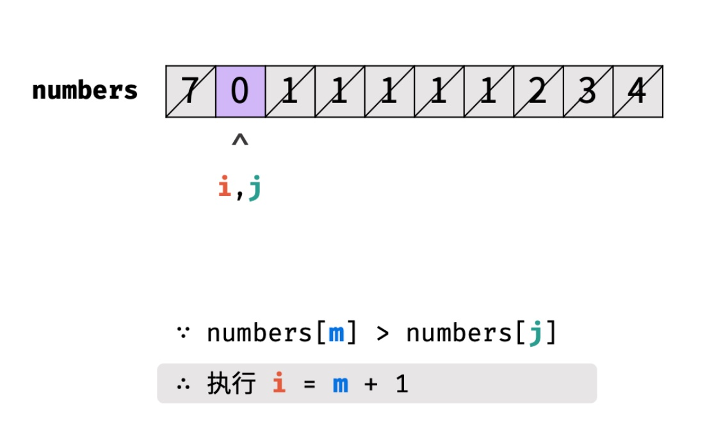

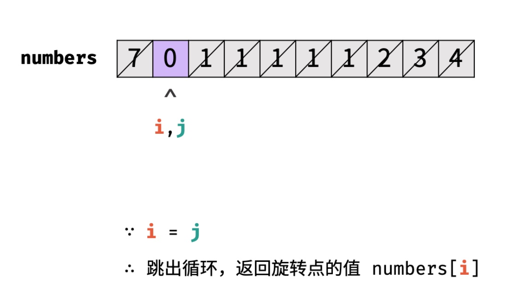


## 代码

```go
func minArray(numbers []int) int {
    left, right := 0, len(numbers)-1

    for left < right {
        mid := (left + right) >> 1
        // 在第一个数组
        if numbers[mid] > numbers[right] {
            left = mid + 1
        } else if numbers[mid] < numbers[right] {   // 在第二个
            right = mid
        } else {
            right--
        }
    }
    return numbers[left]
}
```


## 错误记录/思考

为什么判断是否在第一个数组，必须用 mid 和 right 比较，而不能和 left 比较？比如 [3, 4, 5, 1, 2]，可以通过 mid > right 得到在第一个数组，但同样也可以用 mid > left 判断出同样的结果。

首先可以确定的是，mid 和 left 比较会出错，比如这个测试用例 [1, 1, 0, 1, 1]，两种比较方式结果如下图：

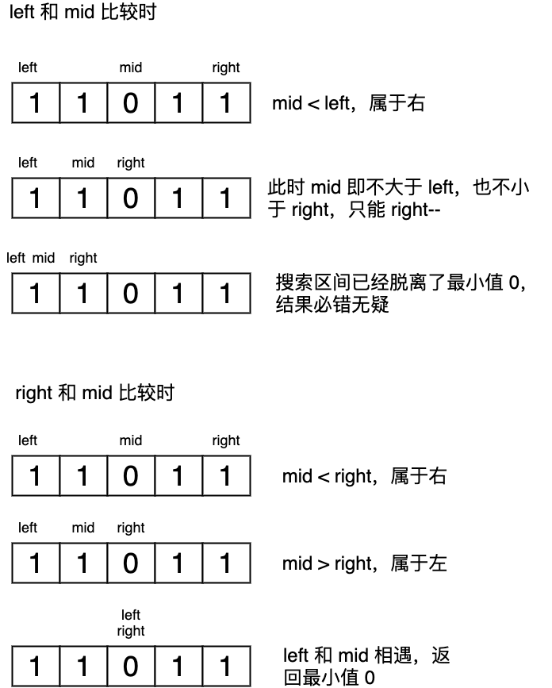


对于这样一种特殊旋转数组 [1, 2, 3, 4, 5] （即旋转了 0 个数），此时 mid 无法确定属于哪个数组，且也不符合之前的**左数组大于右数组**的条件，这种情况下，与 right 比较是安全的，这会将其分配到右数组 [3, 4, 5]，并将搜索区间转移到左部分 [1, 2, 3]。

如果与 left 比较，会错误的分配到右数组 [1, 2, 3]，并将这部分从搜索区间中去除，留下 [4, 5]，结果也显然意见是错误的。

综上，要避免与 left 比较。

<Vssue :title="$title" />