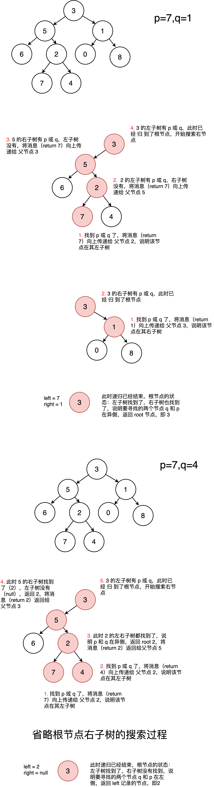

## 题目描述

> 给定一个二叉树, 找到该树中两个指定节点的最近公共祖先。
> 
> 百度百科中最近公共祖先的定义为：“对于有根树 T 的两个结点 
> p、q，最近公共祖先表示为一个结点 x，满足 x 是 p、q 的祖
> 先且 x 的深度尽可能大（一个节点也可以是它自己的祖先）。”
> 
> 例如，给定如下二叉树:  
> root = [3,5,1,6,2,0,8,null,null,7,4]
> 
> 
> 示例 1:
>
> 输入: root = [3,5,1,6,2,0,8,null,null,7,4], 
> p = 5, q = 1
> 输出: 3
> 解释: 节点 5 和节点 1 的最近公共祖先是节点 3。
> 
> 示例 2:
>
> 输入: root = [3,5,1,6,2,0,8,null,null,7,4], 
> p = 5, q = 4
> 输出: 5
> 解释: 节点 5 和节点 4 的最近公共祖先是节点 5。因为根据定
> 义最近公共祖先节点可以为节点本身。

## 算法设计

### 方法1. 递归

这次不多bb直接上代码：

#### 代码：

```go
/**
 * Definition for a binary tree node.
 * type TreeNode struct {
 *     Val int
 *     Left *TreeNode
 *     Right *TreeNode
 * }
 */
func lowestCommonAncestor(root, p, q *TreeNode) *TreeNode {
    if root == nil || root == p || root == q {
        return root
    }
    // 记录左子树部分是否有 p 或 q，如果有，则 left 的值为 p 或 q 的某
    // 一父节点，如果没有则为 null
    left := lowestCommonAncestor(root.Left, p, q)
    // 记录右子树部分是否有 p 或 q，如果有，则 left 的值为 p 或 q 的某
    // 一父节点，如果没有则为 null
    right := lowestCommonAncestor(root.Right, p, q)

    // left 为空，说明左子树部分没有 p，q，返回 right，即在右子树部分
    // 找到的结果
    if left == nil {
        return right
    // 同理如上    
    } else if right == nil {
        return left
    }
    // left 和 right 都不为空，说明 p，q 在异侧，此时当前节点 root 
    // 就是它们的公共父节点
    return root
}
```
#### 递归分析

##### 递归流程图


##### 递归过程



##### 文字分析

递归解析：

1. 终止条件：
    1. 当越过叶节点，则直接返回 null；
    2. 当 rootroot 等于 p, q，则直接返回 root；
2. 递推工作：
    1. 开启递归左子节点，返回值记为 left；
    2. 开启递归右子节点，返回值记为 right；
3. 返回值： 根据 left 和 right ，可展开为四种情况；
    1. 当 left 和 right 同时为空 ：说明 root 的左 / 右子树中都不包含 p,q ，返回 null；
    2. 当 left 和 right 同时不为空 ：说明 p, q 分列在 root 的 异侧 （分别在 左 / 右子树），因此 root 为最近公共祖先，返回 root；
    3. 当 left 为空 ，right 不为空 ：p,q 都不在 root 的左子树中，直接返回 right 。具体可分为两种情况：
        1. p,q 其中一个在 root 的 右子树 中，此时 right 指向 pp（假设为 pp ）；
        2. p,q 两节点都在 root 的 右子树 中，此时的 right 指向 最近公共祖先节点 ；
4. 当 left 不为空 ， right 为空 ：与情况 3. 同理；

参考：https://leetcode-cn.com/problems/er-cha-shu-de-zui-jin-gong-gong-zu-xian-lcof/solution/mian-shi-ti-68-ii-er-cha-shu-de-zui-jin-gong-gon-7/

递归在向上`归`时，会不断根据当前条件，更新返回的信息（参考递归过程图）

### 方法2. 搜索根节点到 p，q 的路径，再求两条路径的最后一个相同节点

#### 代码：

```go
    /**
 * Definition for a binary tree node.
 * type TreeNode struct {
 *     Val int
 *     Left *TreeNode
 *     Right *TreeNode
 * }
 */
func lowestCommonAncestor(root, p, q *TreeNode) *TreeNode {
    var path, pp, qq []*TreeNode
    var flag bool
    findPath(root, p, &path, &pp, &flag)
    
    flag = false
    path = path[0:0]
    findPath(root, q, &path, &qq, &flag)

    size := min(len(pp), len(qq))
    i := 0
    for ; i < size; i++ {
        if pp[i] == qq[i] {
            continue
        } else {
            break
        }
    }
    return pp[i-1]
}

func findPath(root, need *TreeNode, path, res *[]*TreeNode,
              flag *bool) {
    if root == nil || *flag {
        return 
    } 
    *path = append(*path, root)
    if root == need {
        *flag = true
        //*res = *path
        //fmt.Println(res)
        news := make([]*TreeNode, len(*path))
        copy(news, *path)
        //fmt.Println(news)
        *res = news
        return 
    }
    
    findPath(root.Left, need, path, res, flag)
    findPath(root.Right, need, path, res, flag)

    *path = (*path)[:len(*path)-1]
    return 
}

func min(x, y int) int {
    if x < y {
        return x
    }
    return y
}
```
算法的思路已经写在标题里了，分析可以参考文章 `求二叉树根节点到指定节点的路径`，链接：https://zengh1.github.io/dsal/2021/03/27/find-binaryTree-root-to-node-path/

<Vssue :title="$title" />