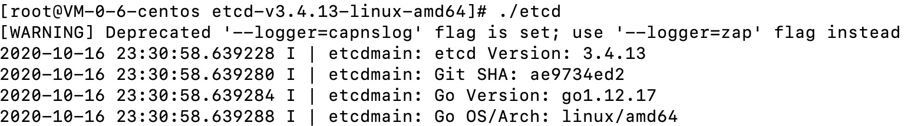
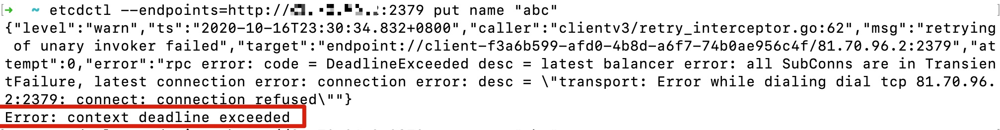
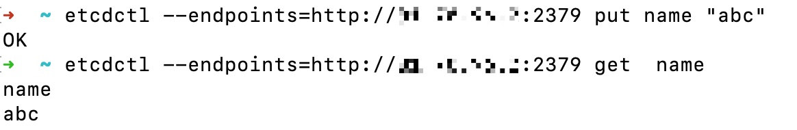

# etcd 远程操作失败：Error: context deadline exceeded


在服务器启动 etcd，并在本地机器通过 **etcdctl --endpoints=http://ip:2379 put name "123"** 命令，在服务器的 etcd 中创建一对键值对， 如下图所示：


服务端 etcd 的启动命令如下：




但是在执行 etcdctl 命令后发生了错误：




经过网上查阅资料，终于找到了解决方法，在启动 etcd 时，需要添加一些参数，否则远程连接无法执行，

完整命令如下：

```shell
$ ./etcd --listen-client-urls http://0.0.0.0:2379 --advertise-client-urls http://0.0.0.0:2379 --listen-peer-urls http://0.0.0.0:2380 --initial-advertise-peer-urls http://0.0.0.0:2380  --initial-cluster my-etcd-1=http://0.0.0.0:2380
```

将ip为0.0.0.0可以理解为不限制连接机器（真正的生产不推荐这样设置）。 


使用上面的命令启动 etcd 后，本地机就可以正常的对其执行操作了




参考：https://github.com/yuedun/micro-service/blob/master/README.md

<Vssue :title="$title" />