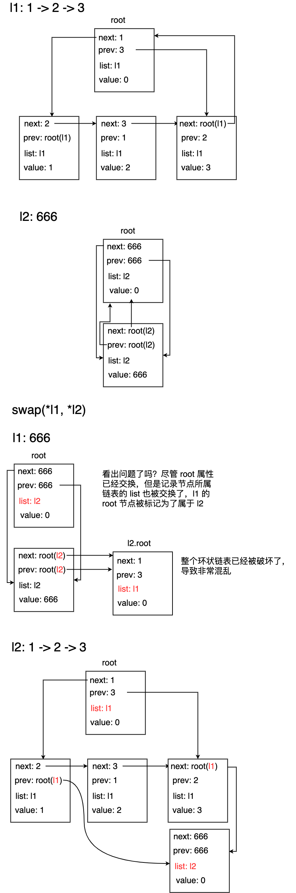

## 场景

在 **LeetCode 255.用队列实现栈** 这道题里，需要用到两个队列来实现一个栈，并且在算法流程中，需要交换这两个队列的内容，例如：队列 A  => [1, 2, 3]，队列 B => [555]，交换后：A => [555]，B => [1, 2, 3]。

go 标准库中并没有提供队列的实现，但是提供了 container/list 这样一个双向链表，所以可以用 list 来模拟一个队列，定义如下结构体：

```go
type MyStack struct {
    Queue1 *list.List	// 队列 1
    Queue2 *list.List	// 队列 2
}
```


在 `push` 方法中需要交换两个队列的内容：

### 写法1

```go
func (this *MyStack) Push(x int) {
  // 省略其他代码
  // 在这里交换值
  this.Queue1, this.Queue2 = this.Queue2, this.Queue1
}
```

上面的代码是可以正确运行的，这里的交换语句让 Queue1 重新指向了另一个 list，Queue2 也同样如此，例如：Queue1 => 0x0001，Queue2 => 0x0013，交换后：Queue1 => 0x0013，Queue2 => 0x0001，这里仅仅是改变了结构体成员属性的值（指向），并没有对属性 list 内部进行更改。


### 写法2

为了让代码更简洁一些，我尝试用两个变量保存 this.Queue1和 this.Queue2：

```go
func (this *MyStack) Push(x int) {
  q1 := this.Queue1
  q2 := this.Queue2
  // 省略其他代码
  // 在这里交换值
  q1, q2 = q2, q1
}
```

上面这段代码会出错，因为这里的交换的是仅仅两个变量 q1 和 q2 的值，并没有对结构体中的属性造成影响。


### 写法3

```go
func (this *MyStack) Push(x int) {
  q1 := this.Queue1
  q2 := this.Queue2
  // 省略其他代码
  // 在这里交换值
  *q1, *q2 = *q2, *q1
}
```

因为 q1 和 q2 都是指针变量，所以可以通过 ***取内容符** 来交换值，就和交换两个指针参数值一样，看起来也没有任何问题，但是运行结果却诡异的出现了死循环，而且排查了许久都找不到原因。


## 测试

**Struct ll**  定义一个类似的结构体：

```go
type ll struct {
	l1 *list.List
	l2 *list.List
}
```


**swap()** 类似 **方法三** 中的取值交换方式：

```go
func swap(l1, l2 *list.List) {
	*l1, *l2 = *l2, *l1
}
```


**_print** 定义一个输出函数用来友好输出链表，输出值的同时也输出地址值：

```go
func _print(name string, l *list.List) {
	fmt.Print(name + ": ")
	for i := l.Front(); i != nil; i = i.Next() {
		fmt.Printf("%v[%p] -> \t", i.Value, i)
	}
	fmt.Println()
}
```


测试代码：

```go
	// 创建两个 list
	l1 := list.New()
	l2 := list.New()
	
// 为两个链表添加值，l1: 1 -> 2 -> 3，l2: 666
	l1.PushBack(1)
	l1.PushBack(2)
	l1.PushBack(3)
	l2.PushBack(666)

	// 输出交换前的值
	fmt.Println("before: ")
	_print("l1", l1)
	_print("l2", l2)

	// 交换函数
	swap(l1, l2)
	// 输出交换后的值
	fmt.Println("after: ")
	_print("l1", l1)
	_print("l2", l2)
```


运行结果：

```
before: 
l1: 1[0xc00009cde0] -> 	2[0xc00009ce10] -> 	3[0xc00009ce40] -> 	
l2: 666[0xc00009ce70] -> 	

after: 
l1: 666[0xc00009ce70] -> 	
l2: 1[0xc00009cde0] -> 	2[0xc00009ce10] -> 	3[0xc00009ce40] -> 	
```


两个链表的值确实已经发生了改变，但是为什么在 **方法 3** 中会产生诡异的错误呢？继续尝试追加值：

```go
	// 交换完之后 pushback
	fmt.Println("after swap pushback: ")
	l2.PushBack(555)
	l1.PushBack(6)
	// 输出两个链表
	_print("l1", l1)
	_print("l2", l2)
```


运行结果：

```
after swap pushback: 
l1: 666[0xc000104e70] -> 	6[0xc000104ed0] -> 	555[0xc000104ea0] -> 	<nil>[0xc000104db0] -> 	
l2: 1[0xc000104de0] -> 	2[0xc000104e10] -> 	3[0xc000104e40] -> 
```

上面的代码向 l1 尾部添加了 元素 6，向 l2 尾部添加元素 555，正确结果应该是：

l1:  666 -> 6

l2:  1 -> 2 -> 3 -> 555

但运行结果却十分诡异：

l1:  666 -> 6 -> 555 -> nil

l2:  1 -> 2 -> 3

本来应该添加到 l2 的 555 被添加到了 l1，并且 l1 还多了一个 额外的 nil


## 分析

结合源码进行了分析（不一定正确）





至于为什么会出现 **测试** 中的诡异情况，发现自己水平有限，画图画的晕头转向，找不出一个合理的原因，只能草草归结于 **list 的环形被破坏，导致产生无法预料的结果**。


## 总结

写法1 `this.Queue1, this.Queue2 = this.Queue2, this.Queue1`  只是交换了结构体属性 q1 和 q2 的指向，没有对 list 内部进行修改，而 写法3 `*this.Queue1, *this.Queue2 = *this.Queue2, *this.Queue1` 则是直接对 list 内部进行了修改，所以产生了无法预料的后果，这也充分说明了指针的危险性。

<Vssue :title="$title" />


